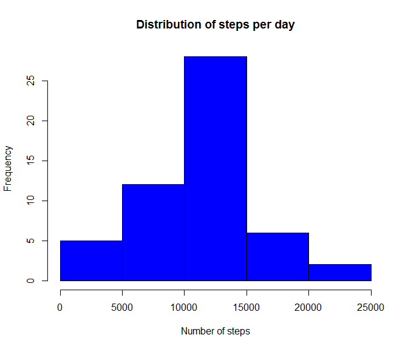
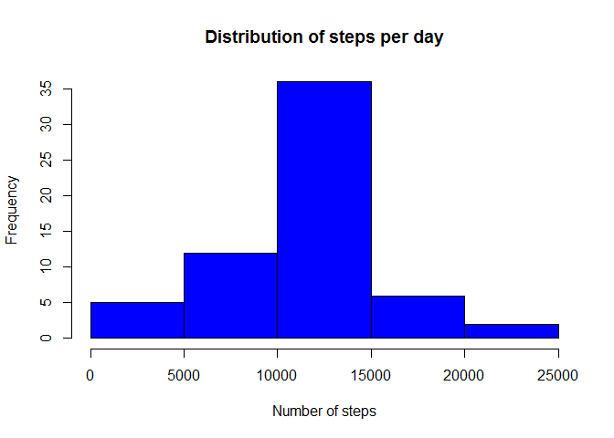
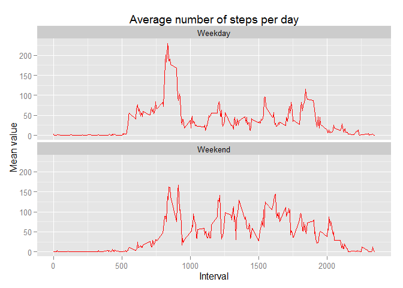

Reproducible Research. Peer Assessment 1
========================================================

## Introduction

It is now possible to collect a large amount of data about personal movement using activity monitoring devices such as a Fitbit, Nike Fuelband, or Jawbone Up. These type of devices are part of the “quantified self” movement – a group of enthusiasts who take measurements about themselves regularly to improve their health, to find patterns in their behavior, or because they are tech geeks. But these data remain under-utilized both because the raw data are hard to obtain and there is a lack of statistical methods and software for processing and interpreting the data.

This assignment makes use of data from a personal activity monitoring device. This device collects data at 5 minute intervals through out the day. The data consists of two months of data from an anonymous individual collected during the months of October and November, 2012 and include the number of steps taken in 5 minute intervals each day.

## Data

The data for this assignment can be downloaded from the course web site:

- Dataset: [Activity monitoring data](https://d396qusza40orc.cloudfront.net/repdata%2Fdata%2Factivity.zip) [52K]

The variables included in this dataset are:

- **steps**: Number of steps taking in a 5-minute interval (missing values are coded as NA)

- **date**: The date on which the measurement was taken in YYYY-MM-DD format

- **interval**: Identifier for the 5-minute interval in which measurement was taken

The dataset is stored in a comma-separated-value (CSV) file and there are a total of 17,568 observations in this dataset.

## Loading and preprocessing the data

Please, download data file in working directory of R project.

R code:


```r
data<-read.csv("./activity.csv")
data.cleaned<-data[!is.na(data$steps),]
```

## Mean total number of steps

In this section mean total number of steps per day was defined.

R code:


```r
library(data.table)
library(dplyr)
data.steps<-data.table(data.cleaned)
data.steps<-data.steps[,Total := sum(steps), by=list(date)]
data.steps<-unique(select(data.steps,date,Total))
```

The distribution of this value is shown below:


```r
hist(data.steps$Total,col="blue",main="Distribution of steps per day",xlab="Number of steps")
```

 

The mean and median of the total number of steps taken per day:


```r
summary(data.steps$Total)
```

```
##    Min. 1st Qu.  Median    Mean 3rd Qu.    Max. 
##      41    8841   10760   10770   13290   21190
```

## The average daily activity pattern

Let's consider dinamic of person's activity regarding time intervals. 

R code:


```r
data.pattern<-data.table(data.cleaned)
data.pattern<-data.pattern[,Mean:= round(mean(steps),2), by=list(interval)]
data.pattern<-unique(select(data.pattern,interval,Mean))
```

Time series plot is shown below:


```r
plot(data.pattern$interval,data.pattern$Mean,type = "l",col="red",main="Average number of steps per day",xlab="Time intervals",ylab="Mean value")
```

 

Let's define maximal number of steps:


```r
max=which.max(data.pattern$Mean)
MaxInterval<-data.frame(data.pattern[max,])[,1]
data.pattern[max,]
```

```
##    interval   Mean
## 1:      835 206.17
```

The time interval with maximal number of steps is 835.

## Imputing missing values

Note that there are a number of days/intervals where there are missing values (coded as NA).

The total number of missing values in the dataset:


```r
data.missed<-data[is.na(data$steps),]
nrow(data.missed)
```

```
## [1] 2304
```

Let's devise a strategy for filling in all of the missing values in the dataset. In our case missing values was replaced with mean value for certain interval.

The strategy for filling in all of the missing values in the dataset realized in R code:


```r
data.missed<-merge(data.missed,data.pattern,by=("interval"))
data.missed$steps<-round(data.missed$Mean)
data.missed$Mean<-NULL
data.new<-rbind(data.missed,data.cleaned)
```

The total number of steps taken each day for new data set with updated missing values:


```r
data.total<-data.table(data.new)
data.total<-data.total[, Total:=sum(steps), by = date]
data.total<-unique(select(data.total,date,Total))
hist(data.total$Total,col="blue",main="Distribution of steps per day",xlab="Number of steps")
```

 

The mean and median total number of steps taken per day:


```r
mean(data.total$Total)
```

```
## [1] 10765.64
```

```r
median(data.total$Total)
```

```
## [1] 10762
```

The mean and median values are close to previous values.
Missing values was added and so the value of frequencies increased. At the same time distribution was not changed prominently.

## Differences in activity patterns between weekdays and weekends

Let's create a new factor variable in the dataset with two levels: “weekday” and “weekend”:


```r
library(lubridate)
data.week<-data.new
data.week$Weekday<-wday(as.Date(data.week$date),label=FALSE)
data.weekend<-data.week[data.week$Weekday %in% c(7,1),]
data.weekend$Factor<-"Weekend"
data.weekday<-data.week[data.week$Weekday %in% 2:6,]
data.weekday$Factor<-"Weekday"
data.week<-rbind(data.weekend,data.weekday)
rm(data.weekend,data.weekday)
```

Time series plot of the 5-minute interval and the average number of steps with a division on weekday and weekend.


```r
data.week<-data.table(data.week)
data.week<-data.week[,Mean:= round(mean(steps),2), by=list(Factor,interval)]
data.week<-unique(select(data.week,Factor,interval,Mean))
library(ggplot2)
ggplot(data.week, aes(x = interval, y = Mean)) + 
  geom_line(aes(group = Factor),colour="red")+
  labs(colour='Day type')+
  facet_wrap(~Factor,ncol=1)+
  xlab("Interval")+
  ylab("Mean value")+
  ggtitle("Average number of steps per day")
```

 
